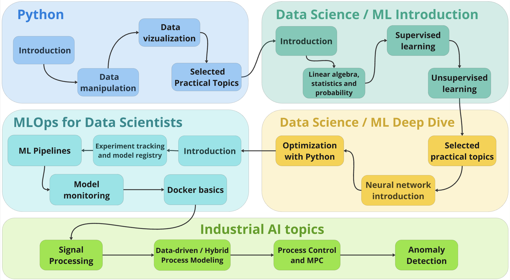
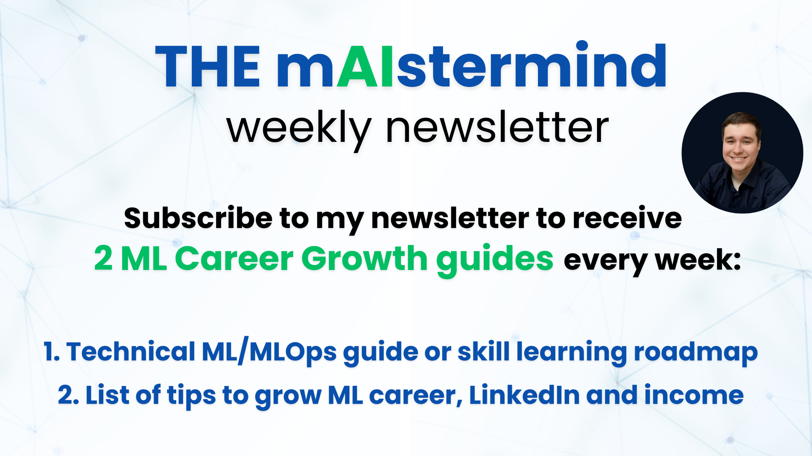

# Machine Learning Roadmap 2025

# 🚀 Goal of the Roadmap
The goal of the roadmap is to provide a list of resources that are enough to become a **Middle Data Scientist starting from ZERO**.
- ✅ Each topic has links to free courses, YouTube videos, articles, or book chapters.
- ✅ The entire roadmap can be completed with 0$ spent.
- ✅ By following the roadmap, you'll be ready for middle-level daily data science work.
- ✅ You'll also be prepared for senior-level data science interviews from the theory perspective.

Most of the resources were personally tested by [me,](https://www.linkedin.com/in/timurbikmukhametov/) when I was learning Machine Learning and Data Science from scratch, upgrading my skills or helping my team members doing so.

---

---

# 📚 Download Machine Learning Roadmap as a PDF.
The PDF version includes comments on each course, making the roadmap easier to follow and convenient to have on hand.

  

# ✉️ Subscribe to my newsletter for Advanced ML Content

  

# 🎯 Who is this roadmap for?
- ✅ Data Science beginners who are looking for a practical step-by-step guide.
- ✅ Data Scientists who aim to level up skills for a job change or promotion.
- ✅ Data Scientists who are looking to refresh their knowledge and prepare for interviews.
- ✅ Data Scientists who want to level up skills in a specific domain, e.g. Optimization.

# 🚀 Roadmap Table of Contents  

## 🐍 1. Python  
- 📖 [1.1 Introduction](#11-introduction)  
- 🛠️ [1.2 Data Manipulation](#12-data-manipulation)  
- 📊 [1.3 Data Visualization](#13-data-visualization)  
  - 🔍 [Intro](#intro)  
  - 🚀 [Deeper Dive](#deeper-dive)  
- 🎯 [1.4 Selected Practical Topics](#14-selected-practical-topics)  
  - 🏗️ [Python environments & Conda setup](#topic-1-python-environments-and-how-to-set-it-up-with-conda)  
  - 🔎 [Demystifying Python methods](#topic-2-demystifying-methods-in-python)  
  - ✨ [Clean Code & Formatting](#topic-3-python-clean-code-tips-and-formatting)  
  - 📦 [Mastering Imports](#topic-4-python-imports)  
  - 🚀 [Understanding Decorators](#topic-5-python-decorators)  

## 📊 2. Data Science / ML Introduction  
- 🔰 [2.1 Introduction](#21-introduction)  
- 🎲 [2.2 Probability, Stats & Linear Algebra](#22-basic-probability-statistics-and-linear-algebra)  
  - ➕ [Linear Algebra](#linear-algebra)  
  - 🎲 [Probability & Statistics](#probability-and-statistics)  
- 🤖 [2.3 Supervised Learning](#23-supervised-learning)  
  - 📈 [Linear Regression](#linear-regression)  
  - 🔢 [Logistic Regression](#logistic-regression)  
  - 🌲 [Random Forest](#random-forest)  
  - ⚡ [Gradient Boosting](#gradient-boosting)  
  - 🔍 [k-NN (k Nearest Neighbours)](#k-nearest-neighbours-k-nn)  
- 🔎 [2.4 Unsupervised Learning](#24-unsupervised-learning)  
  - 🧩 [Clustering](#clustering)  
  - 📉 [Dimensionality Reduction](#dimensionality-reduction)  

## 🔬 3. Data Science / ML Deep Dive  
- 🎯 [3.1 Selected Practical Topics](#31-selected-practical-topics)  
  - 🎯 [Feature Selection](#feature-selection)  
  - 💡 [Feature Importance](#feature-importance)  
  - 🎯 [Model Metrics Evaluation](#model-metrics-evaluation)  
  - 🔁 [Cross-Validation](#cross-validation)  
- 🧠 [3.2 Neural Networks Introduction](#32-neural-networks-introduction)  
- 🔄 [3.3 Optimization with Python](#33-optimization-with-python)  
  - 🚀 [Intro to Optimization](#introduction-to-mathematical-optimization-with-python)  
  - 🧠 [Bayesian Optimization](#bayesian-optimization)  
  - 🛠️ [SciPy Optimization](#optimization-with-scipy)  
  - 🎮 [Interactive Optimization Playground](#interactive-playground-of-several-optimization-methods)  
  - 📚 [Additional Resources](#additional-resources)
- 🎛️ [3.4 Signal Processing](#34-signal-processing)
- ⚠️ [3.5 Anomaly Detection](#35-anomaly-detection)  

## ⚙️ 4. MLOps for Data Scientists  
- 🏗️ [4.1 Introduction](#41-introduction)  
- 📦 [4.2 Model Registry & Experiment Tracking](#42-model-registry-and-experiment-tracking)  
- 🔄 [4.3 ML Pipelines](#43-ml-pipelines)  
- 🛠️ [4.4 Model Monitoring](#44-model-monitoring)  
- 🐳 [4.5 Docker Basics](#45-docker-basics)  
- 📚 [4.6 Additional Resources](#46-additional-resources)

---

## 1. Python
### 1.1 Introduction
Python is the most widely used programming language in Data Science. It’s powerful, easy to learn, and has a vast ecosystem of libraries for data analysis, visualization, and machine learning.

Life is too short, learn Python. Forget R or S or T or whatever other programming language letters you see. And for God’s sake, no Matlab in your life should exist.

💡 **Your goal?** Get comfortable with Python basics and then dive into data manipulation and visualization—essential skills for any Data Scientist!

🔹 **Paid Courses:**
- 🎓 [Basic Python - CodeAcademy](https://www.codecademy.com/learn/learn-python-3)
- 🎓 [Python Programming - DataCamp](https://app.datacamp.com/learn/skill-tracks/python-programming)

🔹 **Free Courses:**
- 🎓 [FutureCoder.io (Hands-on)](https://futurecoder.io/)
- 🎥 [Dave Gray's Python Course](https://www.youtube.com/watch?v=qwAFL1597eM)
- 🛠️ [Mini-projects - freeCodeCamp](https://www.youtube.com/watch?v=8ext9G7xspg)

---

### 1.2 Data Manipulation
Data manipulation is the **core skill** for a Data Scientist. You’ll need to clean, transform, and analyze data efficiently using **Pandas and NumPy**.

- 📊 [Kaggle Pandas Course](https://www.kaggle.com/learn/pandas)
- 📚 [MLCourse.ai - Data Manipulation](https://mlcourse.ai/book/topic01/topic01_intro.html)
- 🔢 [Numpy Basics](https://github.com/ageron/handson-ml2/blob/master/tools_numpy.ipynb)
- 🏋️ [Pandas Exercises](https://github.com/guipsamora/pandas_exercises)

---

### 1.3 Data Visualization
Data visualization helps **communicate insights** effectively. Learning how to use Matplotlib, Seaborn, and Plotly will allow you to create compelling charts and dashboards.

💡 **Your goal?** Understand different types of plots and when to use them.

#### Intro
- 📊 [MLCourse.ai - Data Visualization](https://mlcourse.ai/book/topic02/topic02_intro.html)

#### Deeper Dive
- 🎨 [Matplotlib Examples](https://matplotlib.org/stable/gallery/index.html)
- 📊 [Seaborn Examples](https://seaborn.pydata.org/examples/index.html)
- 📈 [Plotly Interactive Plots](https://plotly.com/python/)

---

### 1.4 Selected Practical Topics
Once you’re comfortable with Python, these **practical topics** will help you **write cleaner, more efficient code** and work effectively in real projects.
#### Topic 1: Python environments and how to set it up with Conda
- 🔗 [Guide to Conda Environments](https://whiteboxml.com/blog/the-definitive-guide-to-python-virtual-environments-with-conda)

#### Topic 2: Demystifying methods in Python
- 🧐 [Understanding Python Methods](https://realpython.com/instance-class-and-static-methods-demystified/)

#### Topic 3: Python clean code tips and formatting
- 🧼 [Clean Code Principles](https://github.com/zedr/clean-code-python)
- 📝 [PEP8 Formatting Guide](https://realpython.com/python-pep8/)
- 🛠️ [Using Black Formatter](https://www.python-engineer.com/posts/black-code-formatter/)
- 🔍 [Linting with Flake8 & Pylint](https://www.jumpingrivers.com/blog/python-linting-guide/)

#### Topic 4: Python imports
- 📦 [Understanding Python Imports](https://realpython.com/python-import/)

#### Topic 5: Python decorators
- 🎭 [Guide to Python Decorators](https://realpython.com/primer-on-python-decorators/)

---

## 2. Data Science / ML Introduction

Now we are getting to the "most interesting" part. 

A solid understanding of **the basics** is crucial to being a great Data Scientist. This doesn’t mean you have to be a math genius, but **understanding core principles** will help both in your work and in interviews.

This roadmap focuses on the most **widely used algorithms**—ones you **must** understand deeply. Once you master these, you’ll be able to explore other algorithms confidently.

---

### 2.1 Introduction
Machine Learning is about finding patterns in data and making predictions.

💡 **Your goal?** Understand the fundamental concepts of ML, classification, and regression before moving forward.

- 🎓 [Andrew Ng’s ML Course (Coursera)](https://www.coursera.org/learn/machine-learning?specialization=machine-learning-introduction)  
  Perfect **introductory course** covering key ML concepts. Instead of browsing multiple intro courses, **start with this one.**
  
💡 **Note:** Coursera offers **financial aid**, so if needed, apply for it (I did it as a student, and it worked!).

---

### 2.2 Basic Probability, Statistics, and Linear Algebra
To build good ML models, you **must** understand basic math concepts. You don’t need to be an expert, but knowing the fundamentals is essential.

#### Linear Algebra
- 🎥 [3Blue1Brown’s Linear Algebra Series](https://www.3blue1brown.com/topics/linear-algebra?ref=mrdbourke.com)  
  **Mind-blowing visuals** that make linear algebra intuitive.
- 📚 [Python Linear Algebra Tutorial - Pablo Caceres](https://pabloinsente.github.io/intro-linear-algebra)  
  **Apply linear algebra concepts in Python** (essential for real-world ML applications).

#### Probability and Statistics
- 🎥 [Statistics Crash Course - Adriene Hill](https://www.youtube.com/playlist?list=PL8dPuuaLjXtNM_Y-bUAhblSAdWRnmBUcr)  
  **Easiest explanations** for complex probability & stats concepts.
- 📚 [Learn Statistics with Python - Ethan Weed](https://ethanweed.github.io/pythonbook/landingpage.html)  
  **Hands-on Python exercises** for better understanding.

---

### 2.3 Supervised Learning
Supervised learning is the foundation of ML. Most real-world applications involve some form of **classification** or **regression** problems.

💡 **Your goal?** Master these fundamental algorithms before moving to more complex techniques.

#### Linear Regression
- 🎥 [Nando de Freitas UBC Lectures](https://www.youtube.com/playlist?list=PL05umP7R6ij2XCvrRzLokX6EoHWaGA2cM)  
  **Breaks down linear regression theory into simple terms.**
- 📚 [Linear Regression: Closed-form & Gradient Descent](https://sebastianraschka.com/Articles/2014_pca_step_by_step.html)  
  **Python implementation & visualizations.**
- 📚 [Regularization in Linear Regression](https://www.kirenz.com/blog/posts/2019-08-12-python-lasso-regression-auto/#lasso-regression-in-python)  
  **Learn Ridge & LASSO regression (important for interviews).**

#### Logistic Regression
- 📚 [MLCourse.ai - Logistic Regression](https://mlcourse.ai/book/topic05/topic05_intro.html)  
  **Great structured learning path for logistic regression.**
- 🔎 [Odds Ratio & Weights Interpretation](https://mmuratarat.github.io/2019-09-05/odds-ratio-logistic-regression)  
  **Key topic for understanding model interpretability.**

#### Gradient Boosting
- 📚 [MLCourse.ai - Gradient Boosting](https://mlcourse.ai/book/topic10/topic10_gradient_boosting.html)  
  **The best guide to gradient boosting models.**
- 📚 [XGBoost Paper](https://arxiv.org/pdf/1603.02754.pdf)  
  **Fundamental research paper for advanced understanding.**
- 🎥 [Gradient Boosting Interactive Playground](https://arogozhnikov.github.io/2016/06/24/gradient_boosting_explained.html)  
  **Awesome visual explanations!**

#### Random Forest
- 🎥 [Nando de Freitas UBC Lectures](https://www.youtube.com/playlist?list=PL05umP7R6ij2XCvrRzLokX6EoHWaGA2cM)  
  **Great overview of bagging and random forests.**
- 📚 [MLCourse.ai - Bagging & Random Forest](https://mlcourse.ai/book/topic05/topic05_intro.html)  
  **Comparison between Random Forest & Gradient Boosting.**

#### k-Nearest Neighbors (k-NN)
- 📚 [Understanding k-NN](https://mmuratarat.github.io/2019-07-12/k-nn-from-scratch)  
  **Simple, intuitive distance-based algorithm.**

---

### 2.4 Unsupervised Learning
Unsupervised learning helps **discover hidden structures** in data when labels are **not available.**

💡 **Your goal?** Understand clustering and dimensionality reduction methods.

#### Clustering
- 📚 [k-Means Clustering](https://mmuratarat.github.io/2019-07-23/kmeans_from_scratch)  
  **Most common clustering method; learn it well!**
- 📚 [DBScan Clustering](https://github.com/christianversloot/machine-learning-articles/blob/main/performing-dbscan-clustering-with-python-and-scikit-learn.md)  
  **Handles noisy datasets better than k-Means.**

#### Dimensionality Reduction
- 📚 [PCA - Step-by-step Guide](https://sebastianraschka.com/Articles/2014_pca_step_by_step.html)  
  **Fundamental technique for reducing data dimensions.**
- 🎥 [t-SNE Explained](https://distill.pub/2016/misread-tsne/)  
  **Great for visualizing high-dimensional data.**
- 📚 [UMAP - Understanding & Applications](https://pair-code.github.io/understanding-umap/)  
  **Powerful alternative to t-SNE for embeddings.**

---

---

## 3. Data Science / ML Deep Dive

This section is where you refine your skills, learn about advanced techniques, and dive into critical ML concepts that help improve model performance and interpretability. Mastering these topics will significantly enhance your ability to build, deploy, and optimize ML models.

---

### 3.1 Selected Practical Topics

#### Feature Selection
Feature selection is **crucial** for building efficient and interpretable models. It helps **reduce overfitting**, improve generalization, and enhance interpretability.

- 📚 [Comprehensive Guide on Feature Selection - Kaggle](https://www.kaggle.com/code/prashant111/comprehensive-guide-on-feature-selection/notebook#Table-of-Contents)  
  A **detailed guide** on different feature selection methods.

#### Feature Importance
Knowing which features influence your model's predictions is essential for interpretability and trust.

- 📚 [Interpretable ML Book - Linear Models](https://christophm.github.io/interpretable-ml-book/limo.html)
- 📚 [Interpretable ML Book - Logistic Models](https://christophm.github.io/interpretable-ml-book/logistic.html)
- 🎥 [Tree-based Feature Importance - Sebastian Raschka](https://www.youtube.com/watch?v=ycyCtxZ0a9w)
- 📚 [Permutation Feature Importance - Interpretable ML Book](https://christophm.github.io/interpretable-ml-book/feature-importance.html)
- 🛠️ [SHAP Library Documentation](https://shap.readthedocs.io/en/latest/example_notebooks/overviews/An%20introduction%20to%20explainable%20AI%20with%20Shapley%20values.html)  
  **SHAP (Shapley Additive Explanations)** is a powerful method to interpret ML models.

#### Model Metrics Evaluation
You built a model, but how do you **measure its performance**? Understanding metrics is essential for making informed decisions.

- 📚 [Regression Metrics - H2O Blog](https://h2o.ai/blog/2019/regression-metrics-guide/)
- 📚 [Classification Metrics - Evidently AI](https://www.evidentlyai.com/classification-metrics)

#### Cross-validation
Cross-validation is **essential** to prevent overfitting and estimate model performance accurately.

- 📚 [Cross-validation Guide - Neptune AI](https://neptune.ai/blog/cross-validation-in-machine-learning-how-to-do-it-right)

---

### 3.2 Neural Networks Introduction

Neural Networks are **one of the most powerful tools** in ML, and they form the backbone of **Deep Learning**.

💡 **Your goal?** Understand the basic architecture of neural networks, backpropagation, and common deep learning techniques.

- 🎓 [Deep Learning Specialization - Andrew Ng](https://www.coursera.org/specializations/deep-learning)  
  A **structured, step-by-step** guide to deep learning concepts.

---

### 3.3 Optimization with Python
Optimization plays a crucial role in tuning ML models, solving complex problems, and improving performance.

#### Introduction to Mathematical Optimization with Python
- 📚 [Numerical Optimization - Indrag49](https://indrag49.github.io/Numerical-Optimization/)  
  **Covers numerical optimization with clear Python examples.**

#### Bayesian Optimization
Bayesian optimization helps **optimize black-box functions**, often used for **hyperparameter tuning**.

- 🎮 [Bayesian Optimization Playground - Distill.pub](https://distill.pub/2020/bayesian-optimization/)  
  **Interactive visual explanations!**
- 📚 [Bayesian Optimization Theory - Nando de Freitas](http://haikufactory.com/files/bayopt.pdf)  
  **Deep dive into Bayesian optimization techniques.**

#### Optimization with SciPy
SciPy provides built-in **optimization algorithms** widely used in ML and scientific computing.

- 📚 [SciPy Optimization Overview](https://caam37830.github.io/book/03_optimization/scipy_opt.html)
- 📚 [Optimization Constraints with SciPy - Towards Data Science](https://towardsdatascience.com/introduction-to-optimization-constraints-with-scipy-7abd44f6de25)
- 📚 [SciPy Optimization Tutorial](https://jiffyclub.github.io/scipy/tutorial/optimize.html#)
- 📚 [Optimization in Python - Duke University](https://people.duke.edu/~ccc14/sta-663-2017/14C_Optimization_In_Python.html)

#### Interactive Playground of Several Optimization Methods (works well for understanding)
🎮 [Optimization Playground - Ben Frederickson](https://www.benfrederickson.com/numerical-optimization/)  

#### Additional Resources
- 📚 [Numerical Optimization Book - Jorge Nocedal](https://www.amazon.ca/Numerical-Optimization-Jorge-Nocedal/dp/0387303030)
- 📚 [Awesome Optimization Resources](https://github.com/ebrahimpichka/awesome-optimization)  

---

### 3.4 Signal Processing
Signal processing is **crucial** in industrial ML projects. You need to filter out noise, remove outliers, and handle **vibration analysis** using **time-frequency domain filters**.

- 🎓 [Signal Processing Course - Mike Cohen (Paid)](https://www.udemy.com/course/signal-processing/?couponCode=2021PM20)
- 📖 [Fourier Transform & Filters](https://en.wikipedia.org/wiki/Fourier_transform)

  
---

### 3.5 Anomaly Detection
Anomaly detection is **critical** in industrial AI for detecting equipment failures, process deviations, and system anomalies.

- 📖 [Anomaly Detection Methods Review - ACM](https://dl.acm.org/doi/abs/10.1145/1541880.1541882)
- 📖 [Anomaly Detection with Python - Neptune AI](https://neptune.ai/blog/anomaly-detection-in-time-series)
- 📖 [Deep Learning Anomaly Detection](https://arxiv.org/pdf/2211.05244)
- 🛠️ [Time Series Anomaly Detection Libraries](https://github.com/rob-med/awesome-TS-anomaly-detection)

---

## 4. MLOps for Data Scientists

MLOps (Machine Learning Operations) is **essential** for deploying, managing, and scaling ML models in production. Many Data Scientists debate whether they need MLOps skills, but having a **solid understanding** will make you a stronger professional who can build and deploy end-to-end solutions.

---

### 4.1 Introduction
Alexey Grigoriev and his team have created an **excellent MLOps course** covering key concepts. Another great resource is **Neptune AI's blog**, which provides **practical guides** on MLOps topics.

- 🎓 [MLOps Zoomcamp - DataTalksClub](https://github.com/DataTalksClub/mlops-zoomcamp/tree/main/01-intro)

---

### 4.2 Model Registry and Experiment Tracking
Model registry and experiment tracking are **critical** for managing models effectively, especially in a team setting.

- 📚 [Model Registry - Neptune AI](https://neptune.ai/blog/ml-model-registry)
- 📚 [Experiment Tracking - Neptune AI](https://neptune.ai/blog/ml-experiment-tracking)
- 🛠️ [Hands-on Example - DataTalksClub](https://github.com/DataTalksClub/mlops-zoomcamp/tree/main/02-experiment-tracking)

---

### 4.3 ML Pipelines
Well-structured **ML pipelines** streamline the model development and deployment process. Avoid hardcoded workflows—use proper pipeline tools!

- 📚 [Building End-to-End ML Pipelines - Neptune AI](https://neptune.ai/blog/building-end-to-end-ml-pipeline)
- 📚 [Best ML Workflow and Pipeline Orchestration Tools - Neptune AI](https://neptune.ai/blog/best-workflow-and-pipeline-orchestration-tools)
- 🛠️ [ML Pipelines with Mage/Prefect - DataTalksClub](https://github.com/DataTalksClub/mlops-zoomcamp/tree/main/03-orchestration)

💡 **Your goal?** Try implementing a small pipeline **from scratch** using one of the recommended tools.

---

### 4.4 Model Monitoring
Monitoring models **post-deployment** is **crucial** to ensure their performance **doesn’t degrade** over time.

- 📚 [MLOps Monitoring Guides - Evidently AI](https://www.evidentlyai.com/mlops-guides)
- 🎓 [MLOps Zoomcamp - Model Monitoring](https://github.com/DataTalksClub/mlops-zoomcamp/tree/main/05-monitoring)

---

### 4.5 Docker Basics
Docker allows you to **containerize** ML models for **consistent deployment across different environments**. Though intimidating at first, it’s **a must-know tool** for any Data Scientist.

- 🎥 [Docker Crash Course - Nana](https://www.youtube.com/watch?v=3c-iBn73dDE)

---

### 4.6 Additional Resources
If you want to **go deeper into MLOps**, check out this roadmap. But **be cautious**—MLOps is vast, so focus on the fundamentals first!

- 📚 [MLOps Roadmap 2024 - Marvelous MLOps](https://marvelousmlops.substack.com/p/mlops-roadmap-2024)
